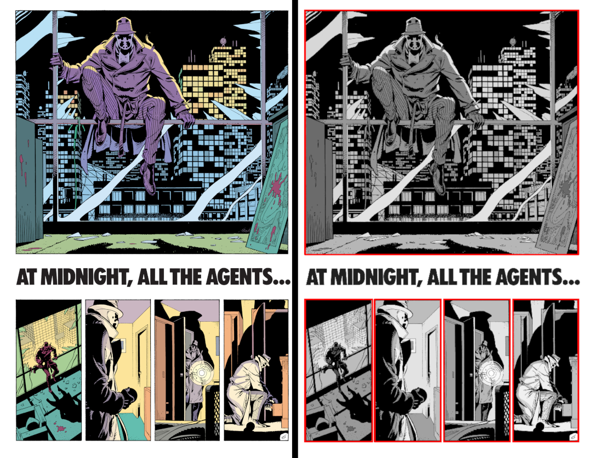
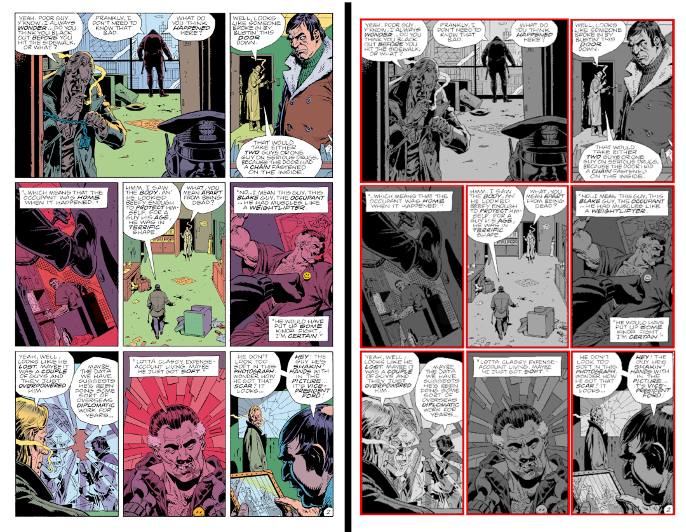

# Panelify
Extracts comic panels from comic pages.




## Requirements
```sh
numpy
opencv
```

## Usage

### In code
```Python
  from panelify import panels
  comic_panels = panels(image)
```
```panels()``` will return a list of tuples containing co-ordinates of rectangles of each panel.

### As script (batch mode)
```sh
  python3 panelify {filename-+.jpg} {start} {number of comics} {Show Comic}
```
Where filename will be the basename of image file with ```+``` as the 3 digit tailing number.   
```start``` is the number of first comic.  
```number of comics``` number of comic pages to process.  
```show comic``` whether to show detected panels ```[true | false]```   

Outputs of rects will be stored in ```panels.txt``` file.  

Example- 
```sh
  python3 panelify Watchmen-+.jpg 7 10 true
```

### Limitations
Currently only plain background colored panels can be detected, inline comic panels are not perfectly detected.

----
